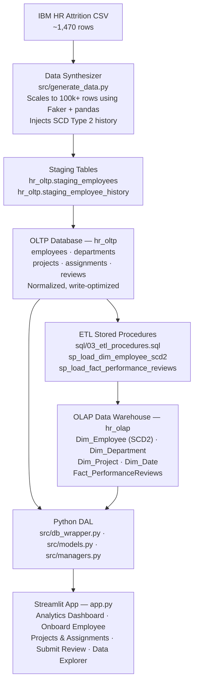
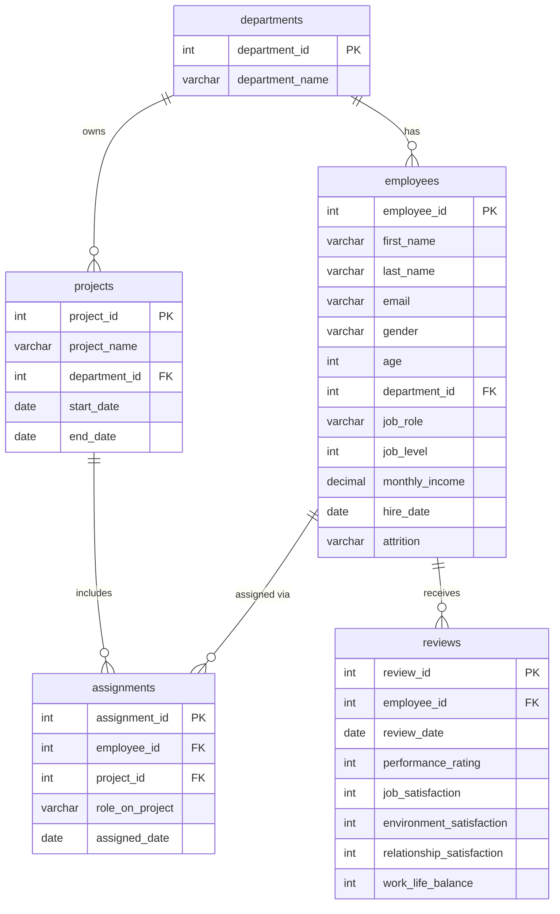
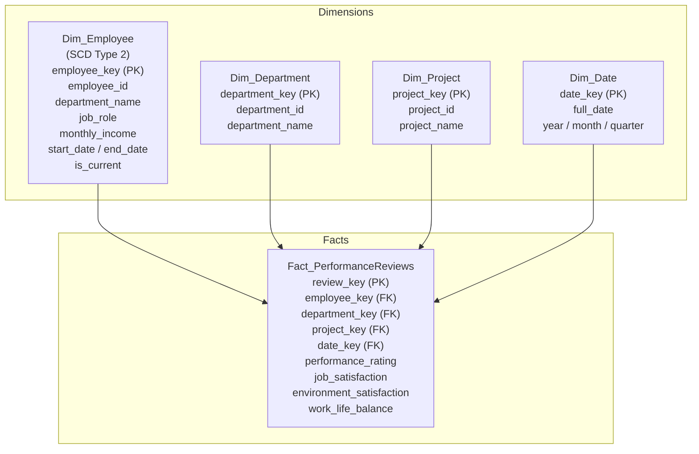
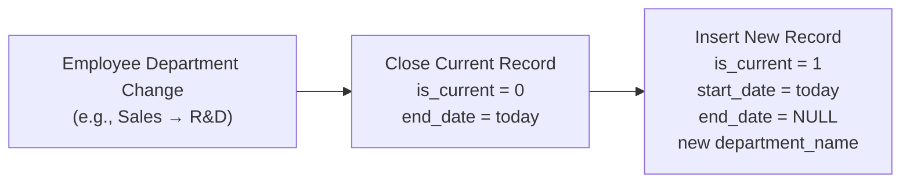

# HR-Lytics

[](https://v4c-lytic.streamlit.app/)  
**Live Application:** [https://v4c-lytic.streamlit.app/](https://v4c-lytic.streamlit.app/)

HR-Lytics is an enterprise HR analytics and operational platform built with Python, MySQL, and Streamlit. It implements a dual-database architecture separating daily transactional operations (OLTP) from reporting and analytics (OLAP data warehouse with SCD Type 2 history).

* **OLTP (`hr_oltp`)**: Normalized database for day-to-day operations — employee onboarding, department tracking, project assignments, and performance reviews.
* **OLAP (`hr_olap`)**: Star schema data warehouse with SCD Type 2 dimension tracking and fact tables for analytics dashboards.

Data flows from OLTP $\rightarrow$ OLAP via automated ETL stored procedures.

---

## System Architecture



---

## Data Models

### OLTP Entity-Relationship Diagram (`hr_oltp`)



### OLAP Star Schema (`hr_olap`)



---

## Slowly Changing Dimension (SCD Type 2) Flow

When an employee changes departments or roles, the existing record is closed with an `end_date` and `is_current = 0`, while a new record is created with `is_current = 1`:



---

## Project Structure

```text
HR-Lytics/
├── migrate.py                  # One-shot migration & ETL runner (uses DBWrapper)
├── app.py                      # Streamlit interactive application
├── requirements.txt            # Python dependencies
├── .env.example                # Template for database configuration
├── src/
│   ├── db_wrapper.py           # MySQL connection management & pooling
│   ├── generate_data.py        # Synthetic dataset generation with SCD2 history
│   ├── managers.py             # Data access layer & business logic
│   ├── models.py               # Dataclass entities (Employee, Project, Review)
│   └── query_loader.py         # Dynamic SQL query loader from sql/ files
├── sql/
│   ├── 01_oltp_schema.sql      # DDL for hr_oltp tables
│   ├── 02_olap_schema.sql      # DDL for hr_olap star schema
│   ├── 03_etl_procedures.sql   # Stored procedures for ETL pipeline
│   ├── 04_analytics_queries.sql# Standalone analytics SQL queries
│   ├── oltp/                   # Modular OLTP CRUD SQL statements
│   └── olap/                   # Modular OLAP analytics SQL statements
├── diagrams/                   # Raw architecture & schema markdown diagrams
└── dataset/                    # Source IBM HR CSV & staging files
```

---

## Setup & Installation

**Prerequisites:** Python 3.10+, MySQL server (e.g., local MySQL or cloud instance like Aiven).

```bash
git clone https://github.com/ashut0shj/HR-Lytics.git
cd HR-Lytics
python -m venv venv
source venv/bin/activate      # Windows: venv\Scripts\activate
pip install -r requirements.txt
```

Copy `.env.example` to `.env` and fill in your connection details:

```bash
cp .env.example .env
```

```ini
DB_HOST=your-mysql-host
DB_USER=your-user
DB_PASSWORD=your-password
DB_NAME=hr_oltp
DB_PORT=3306
```

---

## Running Migration & Launching the App

### 1. Run Migration (First-time Setup)
Run `migrate.py` to generate synthetic data, create schemas, load staging tables, and execute the initial OLAP ETL:

```bash
python migrate.py
```

### 2. Start the Streamlit App
```bash
streamlit run app.py
```

The application will open in your browser at `http://localhost:8501`.

---

## Key App Features

* **Analytics Dashboard**: Real-time metrics, department headcount, attrition analysis, salary distribution, YoY trends, top performers (window functions), and SCD Type 2 audit history.
* **Onboard Employee**: Add new employees into `hr_oltp` and manage department transfers.
* **Projects & Assignments**: Manage company projects and assign staff.
* **Submit Review**: Record satisfaction & performance review ratings.
* **Data Explorer**: Live interactive query & filter tool for operational tables.
* **Refresh OLAP Button**: Syncs operational changes from OLTP to the OLAP data warehouse on demand.
