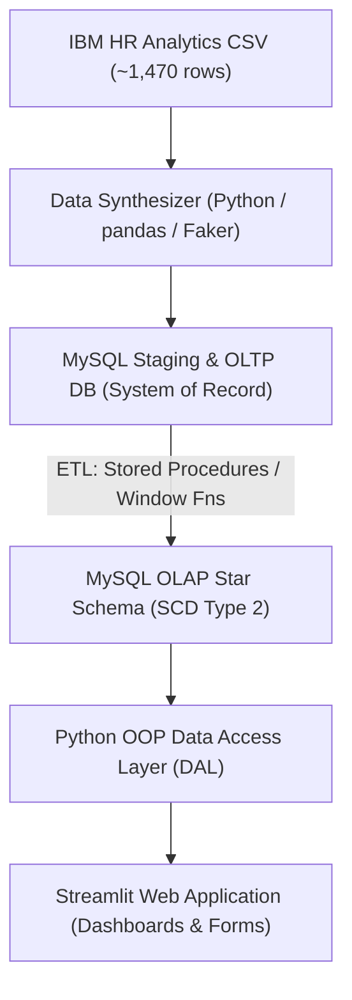

# HR-Lytics — Enterprise Employee Analytics & Data Warehouse

HR-Lytics is an end-to-end Data Engineering and Analytics platform developed as part of the **V4C Data Engineering Training Exercise**. It demonstrates data synthesis, OLTP database modeling, OLAP star schema dimensional modeling with Slowly Changing Dimensions (SCD Type 2), Python OOP Data Access Layer, and an interactive Streamlit analytics dashboard.

---

## 🏗️ System Architecture & Data Flow



---

## 🛠️ Quick Setup & Environment

1. **Create virtual environment:**
   ```bash
   python -m venv venv
   ```

2. **Activate virtual environment:**
   - **Windows (PowerShell):** `.\venv\Scripts\Activate.ps1`
   - **Linux/macOS:** `source venv/bin/activate`

3. **Install dependencies:**
   ```bash
   pip install -r requirements.txt
   ```

---

##  File Placement & Folder Guide

Use this guide to determine where to create and place files within the repository:

```text
HR-Lytics/
├── data/
│   ├── raw/                       # Place original untouched source CSVs (e.g. ibm_hr_attrition.csv)
│   └── synthesized/               # Place scaled output datasets (e.g. employees_100k.csv)
├── sql/
│   ├── oltp/                      # Relational OLTP DDL, DML, constraints & index scripts
│   ├── olap/                      # Star schema DDL scripts (dimension & fact tables)
│   ├── etl/                       # Stored procedures (sp_*), CTEs, & SCD2 merge scripts
│   └── analytics/                 # Analytical & KPI queries (window functions, dense rank)
├── src/
│   ├── synthesizer/               # Python scripts for scaling data & SCD2 history injection
│   ├── db/                        # Singleton DatabaseConnection handlers
│   ├── models/                    # Entity classes (Employee, Project, Review)
│   ├── managers/                  # Data Access Layer (DAL) manager classes
│   └── etl/                       # Python ETL orchestration scripts
├── app/
│   ├── Home.py                    # Streamlit home landing page
│   └── pages/                     # Streamlit multi-page forms and dashboard views
├── diagrams/                      # ER diagrams, dimensional models (Draw.io, PNG exports)
└── tests/                         # Pytest unit & integration test scripts
```

---

## 🚀 Key Modules & Capabilities

1. **Data Synthesizer (`src/synthesizer/`):** Scalable dataset generator using `pandas` and `Faker` to scale raw IBM HR data to 100,000+ synthetic records with realistic SCD Type 2 employment histories.
2. **OLTP Schema (`sql/oltp/`):** Normalized database model designed for high-frequency write operations (employee onboarding, reviews, project updates).
3. **OLAP Schema (`sql/olap/`):** Star schema with `Dim_Employee` (SCD Type 2), `Dim_Department`, `Dim_Project`, `Dim_Date`, and `Fact_Performance_Reviews`.
4. **ETL Pipeline (`sql/etl/`):** SQL stored procedures utilizing CTEs and window functions for continuous incremental processing and SCD Type 2 merge logic.
5. **Python OOP DAL (`src/managers/` & `src/models/`):** Clean Data Access Layer with Singleton database connection pooling and manager classes.
6. **Streamlit App (`app/`):** Multi-page dashboard supporting operational data updates and executive analytical visualizations.

---

## 📖 Planning Documentation

For detailed technical blueprints, refer to [`Planning_docs/`](Planning_docs/):

- 📘 [00_MASTER_PLAN.md](Planning_docs/00_MASTER_PLAN.md) — Architectural overview & phase dependencies
- 📐 [01_FOLDER_STRUCTURE.md](Planning_docs/01_FOLDER_STRUCTURE.md) — Detailed layout & naming conventions
- 🧪 [02_DATA_SYNTHESIS.md](Planning_docs/02_DATA_SYNTHESIS.md) — Data scaling & SCD2 history generator
- 🗄️ [03_OLTP_DESIGN.md](Planning_docs/03_OLTP_DESIGN.md) — Relational schema & DDL specs
- 📊 [04_OLAP_DESIGN.md](Planning_docs/04_OLAP_DESIGN.md) — Dimensional modeling & SCD2 tracking
- ⚙️ [05_ETL_PIPELINE.md](Planning_docs/05_ETL_PIPELINE.md) — Stored procedures & data transformation logic
- 🐍 [06_PYTHON_ARCHITECTURE.md](Planning_docs/06_PYTHON_ARCHITECTURE.md) — Backend design & object models
- 🖥️ [07_STREAMLIT_APP.md](Planning_docs/07_STREAMLIT_APP.md) — UI design, forms, and chart specs
- 🌿 [08_GIT_AND_DEPLOYMENT.md](Planning_docs/08_GIT_AND_DEPLOYMENT.md) — Version control strategy & Streamlit Cloud deploy

---

## 🛠️ Contribution Guidelines

We enforce feature branch naming (`F-xx-<name>`) and standardized commit messages (`vY.XX.ZZ-message`). Please refer to [CONTRIBUTING.md](CONTRIBUTING.md) for full branch and commit guidelines.

---

## 📜 Code of Conduct

Please review our [CODE_OF_CONDUCT.md](CODE_OF_CONDUCT.md) before contributing to ensure a collaborative environment.
