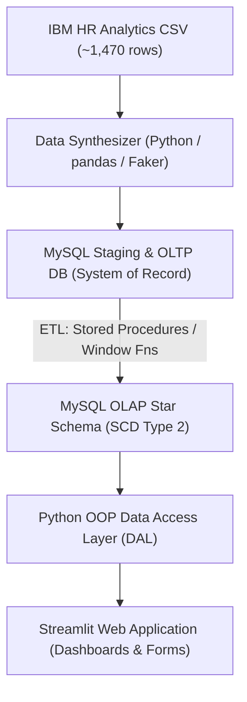

# HR-Lytics — Enterprise Employee Analytics & Data Warehouse
# HR-Lytics

HR-Lytics is an end-to-end Data Engineering and Analytics platform developed as part of the **V4C Data Engineering Training Exercise**. It demonstrates data synthesis, OLTP database modeling, OLAP star schema dimensional modeling with Slowly Changing Dimensions (SCD Type 2), Python OOP Data Access Layer, and an interactive Streamlit analytics dashboard.
An HR analytics web app built with Streamlit and MySQL. It lets you manage employees, projects, and performance reviews through a simple UI, and shows analytics dashboards backed by a star-schema data warehouse.

---

## 🏗️ System Architecture & Data Flow
## What it does


- **Onboard employees** — add new staff, assign them to departments
- **Projects & assignments** — create projects and assign employees to them
- **Performance reviews** — submit and view review scores
- **Analytics dashboard** — headcount, attrition rate, salary breakdowns, year-over-year trends, top performers per department, and SCD Type 2 change history

The app runs against two MySQL databases:
- **OLTP** (`training`) — the live operational tables: `employees`, `departments`, `projects`, `reviews`, `assignments`
- **OLAP** (star schema) — `Dim_Employee`, `Dim_Date`, `Fact_PerformanceReviews` — populated via the ETL procedures in `sql/`

---

## 🛠️ Quick Setup & Environment
## Project layout

1. **Create virtual environment:**
   ```bash
   python -m venv venv
   ```
```
HR-Lytics/
├── app.py                  # Streamlit app entry point
├── requirements.txt
├── .env                    # DB credentials (not committed)
├── src/
│   ├── db/
│   │   ├── db_wrapper.py   # MySQL connection wrapper
│   │   └── query_loader.py # Loads named queries from .sql files
│   ├── managers/
│   │   └── managers.py     # CRUD + analytics logic
│   ├── models/
│   │   └── models.py       # Employee, Project, Review dataclasses
│   └── synthesizer/
│       └── generate_data.py  # Generates 100k+ synthetic HR rows
├── sql/
│   ├── oltp/               # employees, departments, projects, reviews queries
│   ├── olap/               # analytics queries (window functions, SCD2)
│   ├── 01_oltp_schema.sql  # Create OLTP tables
│   ├── 02_olap_schema.sql  # Create star schema tables
│   ├── 03_etl_procedures.sql
│   └── 04_analytics_queries.sql
└── dataset/                # Put the IBM HR CSV here
```

2. **Activate virtual environment:**
   - **Windows (PowerShell):** `.\venv\Scripts\Activate.ps1`
   - **Linux/macOS:** `source venv/bin/activate`
---

3. **Install dependencies:**
   ```bash
   pip install -r requirements.txt
   ```
## Setup

---
**1. Clone and create a virtual environment**

##  File Placement & Folder Guide
```bash
git clone <repo-url>
cd HR-Lytics
python -m venv venv
venv\Scripts\activate       # Windows
# source venv/bin/activate  # Mac/Linux
pip install -r requirements.txt
```

Use this guide to determine where to create and place files within the repository:
**2. Set up your `.env` file**

```text
HR-Lytics/
├── data/
│   ├── raw/                       # Place original untouched source CSVs (e.g. ibm_hr_attrition.csv)
│   └── synthesized/               # Place scaled output datasets (e.g. employees_100k.csv)
├── sql/
│   ├── oltp/                      # Relational OLTP DDL, DML, constraints & index scripts
│   ├── olap/                      # Star schema DDL scripts (dimension & fact tables)
│   ├── etl/                       # Stored procedures (sp_*), CTEs, & SCD2 merge scripts
│   └── analytics/                 # Analytical & KPI queries (window functions, dense rank)
├── src/
│   ├── synthesizer/               # Python scripts for scaling data & SCD2 history injection
│   ├── db/                        # Singleton DatabaseConnection handlers
│   ├── models/                    # Entity classes (Employee, Project, Review)
│   ├── managers/                  # Data Access Layer (DAL) manager classes
│   └── etl/                       # Python ETL orchestration scripts
├── app/
│   ├── Home.py                    # Streamlit home landing page
│   └── pages/                     # Streamlit multi-page forms and dashboard views
├── diagrams/                      # ER diagrams, dimensional models (Draw.io, PNG exports)
└── tests/                         # Pytest unit & integration test scripts
Create a `.env` file in the project root:

```
DB_HOST=localhost
DB_USER=root
DB_PASSWORD=your_password
DB_NAME=training
DB_PORT=3306
```

---
**3. Set up the database**

## 🚀 Key Modules & Capabilities
Run the SQL files in MySQL Workbench (or any client) in order:

1. **Data Synthesizer (`src/synthesizer/`):** Scalable dataset generator using `pandas` and `Faker` to scale raw IBM HR data to 100,000+ synthetic records with realistic SCD Type 2 employment histories.
2. **OLTP Schema (`sql/oltp/`):** Normalized database model designed for high-frequency write operations (employee onboarding, reviews, project updates).
3. **OLAP Schema (`sql/olap/`):** Star schema with `Dim_Employee` (SCD Type 2), `Dim_Department`, `Dim_Project`, `Dim_Date`, and `Fact_Performance_Reviews`.
4. **ETL Pipeline (`sql/etl/`):** SQL stored procedures utilizing CTEs and window functions for continuous incremental processing and SCD Type 2 merge logic.
5. **Python OOP DAL (`src/managers/` & `src/models/`):** Clean Data Access Layer with Singleton database connection pooling and manager classes.
6. **Streamlit App (`app/`):** Multi-page dashboard supporting operational data updates and executive analytical visualizations.
```
sql/01_oltp_schema.sql
sql/02_olap_schema.sql
sql/03_etl_procedures.sql
```

---
**4. (Optional) Generate synthetic data**

## 📖 Planning Documentation
Drop the IBM HR CSV (`WA_Fn-UseC_-HR-Employee-Attrition.csv`) into the `dataset/` folder, then run:

For detailed technical blueprints, refer to [`Planning_docs/`](Planning_docs/):
```bash
python src/synthesizer/generate_data.py
```

- 📘 [00_MASTER_PLAN.md](Planning_docs/00_MASTER_PLAN.md) — Architectural overview & phase dependencies
- 📐 [01_FOLDER_STRUCTURE.md](Planning_docs/01_FOLDER_STRUCTURE.md) — Detailed layout & naming conventions
- 🧪 [02_DATA_SYNTHESIS.md](Planning_docs/02_DATA_SYNTHESIS.md) — Data scaling & SCD2 history generator
- 🗄️ [03_OLTP_DESIGN.md](Planning_docs/03_OLTP_DESIGN.md) — Relational schema & DDL specs
- 📊 [04_OLAP_DESIGN.md](Planning_docs/04_OLAP_DESIGN.md) — Dimensional modeling & SCD2 tracking
- ⚙️ [05_ETL_PIPELINE.md](Planning_docs/05_ETL_PIPELINE.md) — Stored procedures & data transformation logic
- 🐍 [06_PYTHON_ARCHITECTURE.md](Planning_docs/06_PYTHON_ARCHITECTURE.md) — Backend design & object models
- 🖥️ [07_STREAMLIT_APP.md](Planning_docs/07_STREAMLIT_APP.md) — UI design, forms, and chart specs
- 🌿 [08_GIT_AND_DEPLOYMENT.md](Planning_docs/08_GIT_AND_DEPLOYMENT.md) — Version control strategy & Streamlit Cloud deploy
This generates `dataset/staging_employees.csv` and `dataset/staging_employee_history.csv` — load them into the DB using the ETL procedure.

---

## 🛠️ Contribution Guidelines
## Run the app

We enforce feature branch naming (`F-xx-<name>`) and standardized commit messages (`vY.XX.ZZ-message`). Please refer to [CONTRIBUTING.md](CONTRIBUTING.md) for full branch and commit guidelines.
```bash
streamlit run app.py
```

Opens at `http://localhost:8501`.

---

## 📜 Code of Conduct
## Tech stack

Please review our [CODE_OF_CONDUCT.md](CODE_OF_CONDUCT.md) before contributing to ensure a collaborative environment.
- Python 3.10+
- Streamlit
- MySQL (mysql-connector-python)
- Pandas + Plotly
- Faker (for data synthesis)
