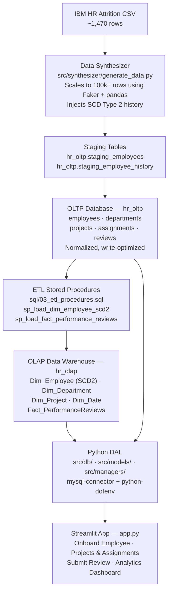

# System Architecture

This diagram shows the end-to-end data journey — from the raw IBM HR CSV all the way through to the Streamlit dashboard the end user sees.

The app talks to **both** databases at runtime:
- **hr_oltp** — for all write operations (onboarding, reviews, project assignments)
- **hr_olap** — for all read/analytics operations (dashboard charts, SCD2 history)

