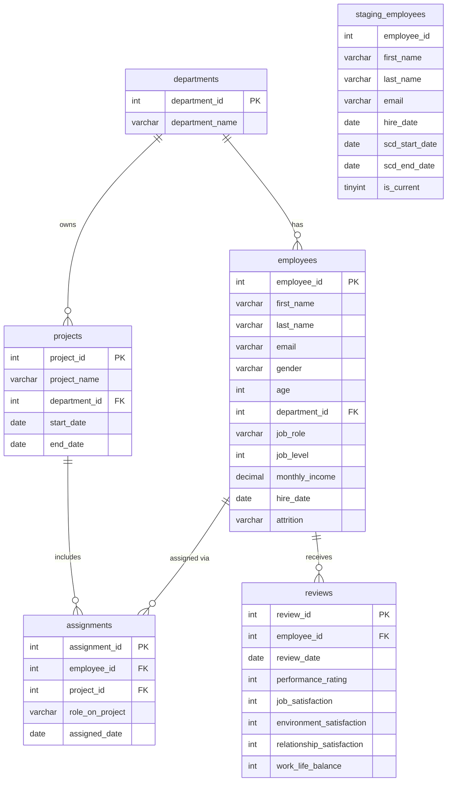

# OLTP Entity-Relationship Diagram

The operational database (`hr_oltp`) is normalized for fast, consistent read/write operations. Each table stores one thing and one thing only.

**Key design decisions:**
- `employees` only stores the *current* state. Historical versions live in `Dim_Employee` (OLAP side) via SCD Type 2.
- `assignments` is the many-to-many bridge between employees and projects.
- Ratings use a 1–4 integer scale matching the original IBM dataset.

