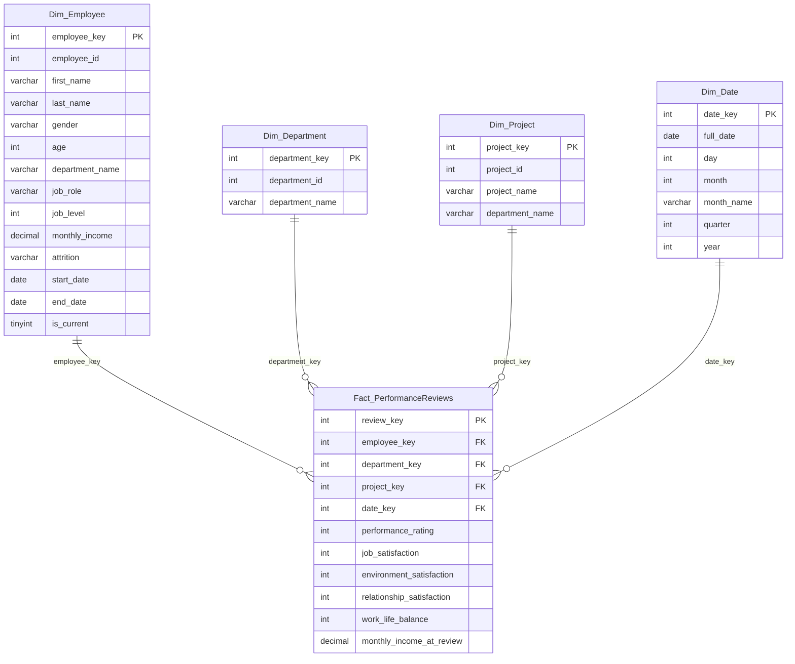

# OLAP Star Schema

The analytics database (`hr_olap`) uses a classic star schema. One fact table in the centre holds the numbers we want to analyze, and four dimension tables hang off it to provide context (who, what, when, where).

**Key points:**
- `Dim_Employee` uses **SCD Type 2** — the same `employee_id` can appear multiple times, each version with a different `employee_key` and date range. Facts always join to the key that was current *at the time of the event*, keeping historical reports accurate.
- `Dim_Date` is pre-populated once (2015–2027) so every fact row always finds a match.
- `monthly_income_at_review` is stored on the fact itself — a snapshot of what the employee was earning when the review was submitted, independent of any later salary changes.

