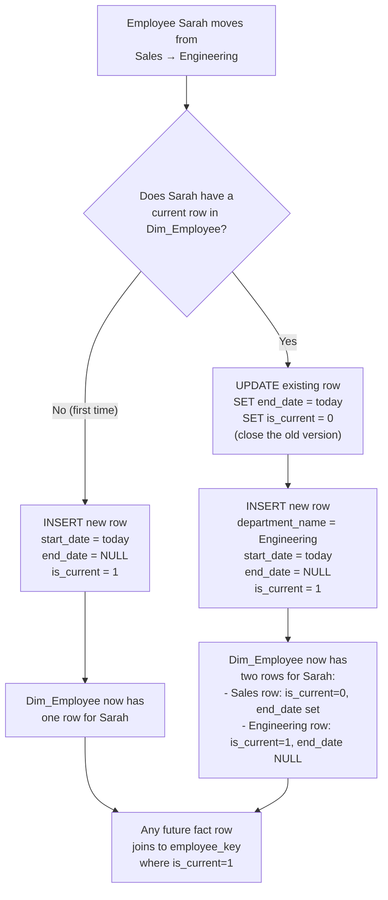

# SCD Type 2 — How It Works

SCD Type 2 (Slowly Changing Dimension, Type 2) is a technique for tracking historical changes in a dimension table. Instead of overwriting a row when something changes, you **close the old version** and **insert a new one**. This way you never lose history.

## The two triggers in this project

1. **Bulk load** — when the synthesizer CSV is loaded via `sp_load_dim_employee_scd2`, employees who have a history record in `staging_employee_history` get their old version inserted first (closed), then their current version inserted open.
2. **Live change** — when a user moves an employee to a new department through the Streamlit app, `AnalyticsManager.apply_scd2_department_change()` fires the same close/insert logic in real time.

## Step-by-step flow

## What a Dim_Employee table looks like after a department change

| employee_key | employee_id | department_name | start_date | end_date | is_current |
|---|---|---|---|---|---|
| 1001 | 42 | Sales | 2022-03-01 | 2024-11-14 | 0 |
| 1087 | 42 | Engineering | 2024-11-15 | NULL | 1 |

- The `is_current = 0` row tells you Sarah *was* in Sales until 2024-11-14.
- The `is_current = 1` row is her live record — null `end_date` means "still true today".
- Facts recorded while she was in Sales will still join to `employee_key = 1001`, keeping those reports accurate even after the move.

