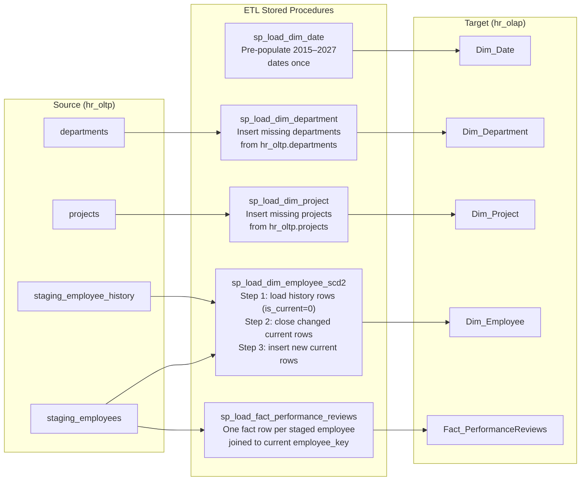

# ETL Pipeline

The ETL (Extract, Transform, Load) pipeline moves data from the raw staging tables into the clean OLAP star schema. It runs as a set of MySQL stored procedures defined in `sql/03_etl_procedures.sql`.

## Overview



## Run order

The procedures must be called in this exact sequence — each one depends on the previous:

```sql
CALL sp_load_dim_date('2015-01-01', '2027-12-31');
CALL sp_load_dim_department();
CALL sp_load_dim_project();
CALL sp_load_dim_employee_scd2();
CALL sp_load_fact_performance_reviews();
```

## Design notes

- **Idempotent** — all procedures use `WHERE NOT EXISTS` guards or UPDATE+INSERT patterns, so re-running them won't create duplicates.
- **Cross-database joins** — the procedures reference both `hr_oltp.*` and `hr_olap.*` tables directly. Both schemas must live on the same MySQL server.
- **SCD2 merge logic** — `sp_load_dim_employee_scd2` is the most complex: it detects attribute changes by comparing incoming staging rows against existing `Dim_Employee` rows, closes stale versions, and opens new ones.

